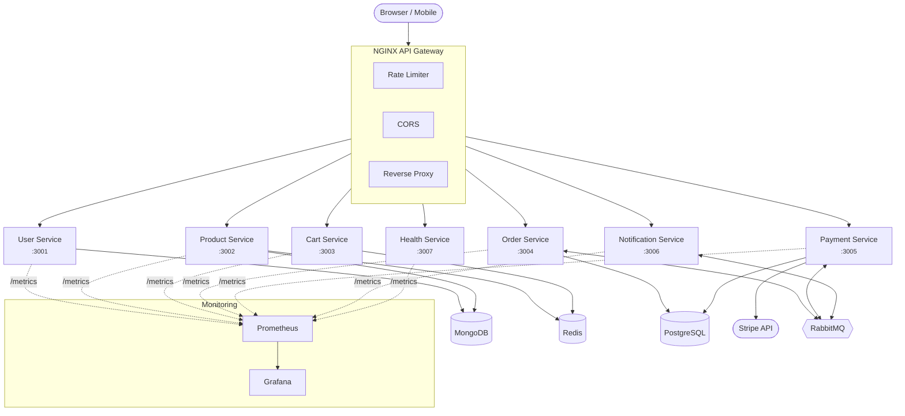
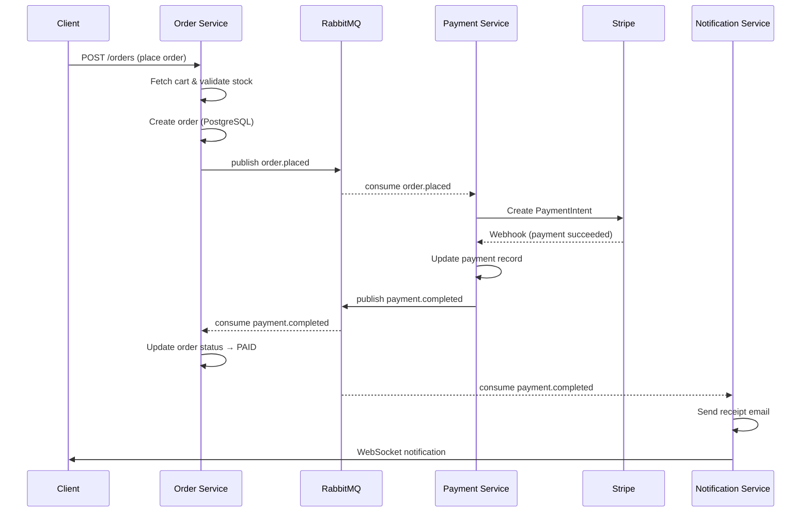
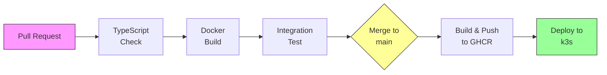

# E-Commerce API

NO LONGER RUNNING

A production-grade, event-driven microservices platform built with Node.js, TypeScript, and modern cloud-native tooling.

> **Live Demo:** [dmandevv.shop](https://dmandevv.shop)

### What you can do right now

- Browse a product catalog with real images and reviews
- Register an account and log in (JWT auth)
- Add products to a Redis-backed shopping cart
- Checkout with Stripe (test mode)
- View order history and track status
- Receive real-time notifications via WebSocket

---

## Tech Stack

| Layer | Technologies |
|-------|-------------|
| **Runtime** | Node.js 22 &middot; TypeScript 5.7 (strict) |
| **Backend** | Express.js 5 &middot; Zod 4 schema validation |
| **Frontend** | Next.js 14 &middot; React 18 &middot; Tailwind CSS &middot; Radix UI |
| **Databases** | MongoDB 7 (Mongoose 9) &middot; PostgreSQL 16 (Prisma 7) &middot; Redis 7 |
| **Messaging** | RabbitMQ 3 (amqplib) &middot; topic exchange &middot; durable queues |
| **Auth** | JWT (HS256) &middot; bcrypt password hashing |
| **Payments** | Stripe API &middot; webhook verification |
| **Storage** | Cloudinary (image CDN) &middot; Multer (upload handling) |
| **Notifications** | Nodemailer (SMTP) &middot; Socket.IO (real-time) |
| **Gateway** | NGINX &middot; rate limiting &middot; CORS &middot; WebSocket proxy |
| **Containers** | Docker &middot; Docker Compose &middot; multi-stage builds |
| **Orchestration** | Kubernetes (k3s) &middot; Traefik ingress &middot; rolling updates |
| **CI/CD** | GitHub Actions &middot; GHCR &middot; automated deploy to k3s |
| **Monitoring** | Prometheus &middot; Grafana &middot; ELK Stack (optional) |
| **Testing** | Vitest 4 &middot; V8 coverage (80%+ threshold) |
| **Resilience** | Circuit breaker pattern &middot; health checks &middot; graceful shutdown |

---

## Architecture



---

## Services

| Service | Port | Database | What It Does |
|---------|------|----------|-------------|
| **User** | 3001 | MongoDB | Registration, login, JWT auth, role management |
| **Product** | 3002 | MongoDB + Redis | CRUD, image upload (Cloudinary), reviews, search, caching |
| **Cart** | 3003 | Redis | Stateless cart with 3-day TTL, quantity management |
| **Order** | 3004 | PostgreSQL | Order creation, status tracking, history |
| **Payment** | 3005 | PostgreSQL | Stripe integration, webhook handling, payment events |
| **Notification** | 3006 | &mdash; | Email templates (Nodemailer), real-time updates (Socket.IO) |
| **Health** | 3007 | &mdash; | Aggregated health checks across all services |

All services share a common TypeScript library (`@ecommerce/shared`) providing error classes, middleware, event types, circuit breaker, and Prometheus metrics.

---

## Event-Driven Checkout Flow



---

## Project Structure

```
E-Commerce-API/
├── services/
│   ├── user-service/          # JWT auth, user CRUD
│   ├── product-service/       # Catalog, images, reviews
│   ├── cart-service/          # Redis cart
│   ├── order-service/         # Order lifecycle
│   ├── payment-service/       # Stripe payments
│   ├── notification-service/  # Email + WebSocket
│   └── health-service/        # Health aggregator
├── shared/                    # @ecommerce/shared library
│   └── src/
│       ├── circuit-breaker/   # Fault tolerance
│       ├── errors/            # Custom error classes
│       ├── events/            # RabbitMQ event schemas
│       ├── metrics/           # Prometheus helpers
│       └── middleware/        # Auth, validation, request ID
├── frontend/                  # Next.js 14 storefront
├── gateway/                   # NGINX config (dev + prod)
├── k8s/                       # Kubernetes manifests
├── monitoring/                # Prometheus + Grafana config
├── scripts/                   # Seed, health check, dev tools
├── docker-compose.yml         # Full local dev stack
└── docker-compose.prod.yml    # Production (external DBs)
```

---

## Getting Started

**Prerequisites:** Docker Desktop, Node.js 22+

```bash
# 1. Clone and install
git clone https://github.com/dmandevv/E-Commerce-API.git
cd E-Commerce-API
npm install

# 2a. Quick start — no .env required (uses dev defaults, Stripe/Cloudinary won't work)
docker compose -f docker-compose.yml -f docker-compose.dev.yml up -d --build --wait

# 2b. Full start with Doppler (recommended) — secrets injected at runtime, no .env file needed
#     Install Doppler CLI: https://docs.doppler.com/docs/install-cli
#     Then: doppler login && doppler setup
doppler run -- docker compose up -d --build --wait

# 2c. Full start without Doppler — copy .env.example, fill in real credentials, then:
cp .env.example .env
docker compose up -d --build --wait

# 3. Seed the database (admin user + 10 products)
docker compose run --rm seed

# 4. Start the frontend
cd frontend && npm run dev
```

| URL | What |
|-----|------|
| `http://localhost:3000` | Next.js storefront |
| `http://localhost:80` | API Gateway |
| `http://localhost:15672` | RabbitMQ Management |
| `http://localhost:3100` | Grafana dashboards |
| `http://localhost:9090` | Prometheus |

---

## CI/CD Pipeline



**CI (Pull Requests):** Type check all services &rarr; Build all Dockerfiles in parallel &rarr; Smoke test full stack with `docker compose up`

**CD (Merge to main):** Build multi-platform images &rarr; Push to GitHub Container Registry &rarr; SSH deploy to k3s with rolling updates

---

## Roadmap

> **Current phase: 1 &mdash; Foundation & Security Hardening**

- [x] **Phase 1.1 &mdash; Testing Infrastructure**
  27 test files, 223 unit tests, Vitest + V8 coverage
- [ ] **Phase 1.2 &mdash; Authentication & Security**
  Refresh tokens, email verification, password reset, CSRF, input sanitization
- [ ] **Phase 1.3 &mdash; Environment Separation**
  Dev/staging/prod configs, secrets management
- [ ] **Phase 2 &mdash; Core E-Commerce**
  Shipping, inventory reservation, product variants, Elasticsearch search, wishlist, coupons, returns
- [ ] **Phase 3 &mdash; Frontend Polish**
  Admin dashboard, order tracking, SEO, accessibility (WCAG 2.1 AA)
- [ ] **Phase 4 &mdash; Observability**
  Structured logging (Pino), distributed tracing (OpenTelemetry), alerting, dead letter queues
- [ ] **Phase 5 &mdash; Performance**
  Cache strategy, DB optimization, load testing (k6), async workers
- [ ] **Phase 6 &mdash; Advanced Features**
  Recommendation engine, i18n/multi-currency, analytics, API docs (OpenAPI), canary deploys

Full roadmap: [`.claude/ROADMAP.md`](.claude/ROADMAP.md)
